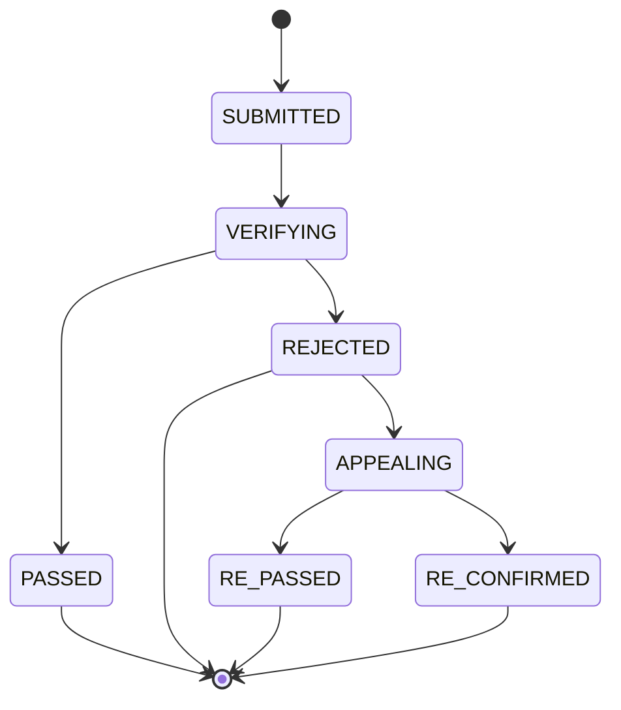

# 运动记录真实性校验系统 · 需求文档（审批版 · 深入版）

版本：v2.0（深入版）｜ 状态：**已确认** ｜ 依据：项目需求确认会（2026-04 逐项确认，见 §12 审批确认）
说明：本版在 v1.0 基础上补齐**算法细节、字段级表结构、状态机迁移矩阵、事件定义、分布式设计、验收用例**，作为开发与验收的唯一依据。

---

## 一、项目概述

### 1.1 背景
运动社区平台存在刷里程、伪造 GPS 轨迹等作弊行为，直接影响榜单可信度与赛事公平。需在秒级判定运动记录真实性，且不能误伤真实用户。

### 1.2 目标
构建"能判断运动记录是否真实"的后端微服务系统（反作弊风控定位），形成 **提交 → 校验 → 判定 → 申诉 → 榜单沉淀** 完整闭环；作为微服务架构能力的完整落地实践。

### 1.3 形态
- 后端：4 微服务（网关/用户/记录/校验），Spring Cloud Alibaba 技术栈；
- 前端：极简轨迹可视化页（AI 辅助生成，仅演示"真实通过 vs 伪造拦截"）；
- 部署：Docker Compose 一键起，本地演示 + 录屏演示视频（已确认不购买云服务器）。

## 二、范围定义

### 2.1 本期范围（P0 必做）
| 编号 | 模块 | 内容 |
| --- | --- | --- |
| F1 | 账号与登录 | 注册、登录（密码+验证码）、JWT + refresh token 会话 |
| F2 | 运动记录 | 提交（元数据+GPS 轨迹点）、分片存储、查询 |
| F3 | 校验引擎 | 预处理（漂移过滤）+ 规则链（速度/加速度/停留/距离一致性）+ 判定证据 |
| F4 | 审核状态机 | SUBMITTED→VERIFYING→PASSED/REJECTED；REJECTED→APPEALING→终判 |
| F5 | 申诉 | 提交申诉、后台复核、改判（含榜单回滚） |
| F6 | 榜单 | 总榜+好友榜，仅 pass 里程，贡献快照+改判回滚 |
| F7 | 好友（双向） | 申请/同意/拒绝、好友列表（并发互加去重） |
| F8 | 点赞 | 对 pass 记录点赞/取消，Redis 计数+异步落库 |
| F9 | 管理端（极简） | 记录查询、申诉处理、阈值配置查看（Swagger 级） |
| F10 | 横向能力 | 幂等、RocketMQ 事件、Redisson 锁、Sentinel 限流熔断、Caffeine 二级缓存、Nacos 规则灰度 |

### 2.2 明确不做（仅作设计说明）
支付、赛事、奖牌、社区图文、私信、帖子评论、ES 搜索、Seata、Canal 实现、K8s、真实地图拓扑、信用分、注销/数据导出。

### 2.3 优先级
P1（尽量）：规则灰度完整实现、压测报告、云部署+演示视频、前端可视化页。

## 三、总体架构

### 3.1 服务划分与调用关系
```
                 ┌─────────────────────────────┐
  App/前端 ───►  │  gateway-service             │  Sentinel 网关限流、JWT 鉴权、路由
                 └──────┬──────────────┬───────┘
                        ▼              ▼
                 user-service    record-service ──Feign──► verify-service
                 (user_db)       (record_db 分片)         (verify_db)
                        ▲              │
                        └──Feign好友列表 │ RocketMQ 事件: VERIFIED/REJECTED/REVERSED
                                       ▼
                                  榜单刷新/审计（消费者）
```
| 服务 | 主要职责 | 独立存储 |
| --- | --- | --- |
| gateway-service | 路由、JWT 鉴权、Sentinel 网关限流 | 无状态 |
| user-service | 注册/登录/JWT、好友（申请/同意/列表） | user_db |
| record-service | 轨迹提交/分片存储/查询、状态机、点赞、榜单（总/好友）、发布 RocketMQ 事件 | record_db |
| verify-service | 预处理+规则链、判定证据、Caffeine 缓存、Sentinel 熔断、Nacos 规则灰度 | verify_db |

### 3.2 工程结构
父 pom（统一版本）+ `common`（统一 Result/错误码/异常）+ `api`（Feign 接口，接口与实现分离）+ 4 服务模块 + gateway。跨服务调用一律走 api 模块接口（record-api、verify-api、user-api）。

### 3.3 技术栈与版本矩阵（已定稿）
| 组件 | 版本 |
| --- | --- |
| Java / Spring Boot | 21 / 3.2.4 |
| Spring Cloud / SCA | 2023.0.1 / 2023.0.1.0 |
| Nacos / Sentinel | 2.3.2 / 1.8.6 |
| MyBatis-Plus | mybatis-plus-spring-boot3-starter 3.5.7 |
| ShardingSphere-JDBC | 5.4.1+ |
| Redisson | 3.27+ |
| RocketMQ | rocketmq-spring-boot-starter 2.3.x（独立集成） |
| Caffeine / Lombok | 3.1.x / 1.18.30+ |

## 四、功能需求（接口级）

> 通用约定：所有 JSON 接口返回 `{"code":0,"message":"success","data":...}`；业务错误码见 4.8。

### 4.1 账号与好友（user-service）
| 功能 | 接口 | 约束 | 验收 |
| --- | --- | --- | --- |
| 注册 | POST /api/auth/register | BCrypt；手机号唯一 | 重复手机号 → code 2001 |
| 登录 | POST /api/auth/login | 返回 access + refresh token | 错密码 → 401 并计失败（窗口限频+失败锁定，讲设计） |
| 好友申请 | POST /api/friends/requests | 状态 PENDING/ACCEPTED/REJECTED/CANCELLED | 重复申请幂等（code 5001 或返回原单） |
| 同意/拒绝 | POST /api/friends/requests/{id}/accept·reject | 仅 PENDING 可流转；ACCEPTED 落 friendship（user_low<user_high 唯一索引） | 并发互加只产生一条关系 |
| 好友列表 | GET /api/friends?page=&size= | 分页 | 只返回 ACCEPTED |

请求/响应示例（好友申请）：
```json
POST /api/friends/requests
{ "targetUserId": 1002 }
→ 200 {"code":0,"data":{"id":5,"fromUser":1001,"toUser":1002,"status":"PENDING"}}
→ 409 {"code":5001,"message":"重复申请或已存在关系"}
```

### 4.2 运动记录（record-service）
| 功能 | 接口 | 约束 | 验收 |
| --- | --- | --- | --- |
| 提交记录 | POST /api/records | 含 request_id、points[]；ShardingSphere 按 user_id 分片 | 同 request_id 重复提交返回原结果（幂等） |
| 记录详情 | GET /api/records/{id} | 含状态、判定证据 | 状态迁移符合 S1 |
| 记录列表 | GET /api/records?page=&size=&sportType= | 分页，仅本人 | 越权访问 → 403（code 1002） |

请求示例：
```json
POST /api/records
{
  "requestId": "req-20260413-0001",
  "sportType": "RUNNING",
  "startTime": "2026-04-13T07:00:00Z",
  "endTime": "2026-04-13T07:32:00Z",
  "points": [
    {"seq": 0, "lat": 31.2304, "lng": 121.4737, "ts": 1786580400000, "speed": 0.0},
    {"seq": 1, "lat": 31.2305, "lng": 121.4738, "ts": 1786580401000, "speed": 1.2}
  ]
}
→ 202 {"code":0,"data":{"recordId":123,"status":"VERIFYING"}}
```

### 4.3 校验引擎（verify-service）—— 项目灵魂，算法细节见 5.2
| 功能 | 接口 | 约束 | 验收 |
| --- | --- | --- | --- |
| 判定 | Feign POST /verify/records/{recordId} | 同步返回 verdict + rule_hits | 伪造拦截率 ≥90%、真实通过率 ≥95% |
| 阈值查询 | GET /verify/rules（管理端） | Nacos 配置 + Caffeine 缓存 | 改配置 60s 内生效 |

### 4.4 申诉（verify-service + 管理端）
| 功能 | 接口 | 约束 | 验收 |
| --- | --- | --- | --- |
| 提交申诉 | POST /api/records/{id}/appeal | 仅 REJECTED 可申诉 | REJECTED→APPEALING |
| 复核改判 | POST /api/admin/appeals/{id}/review | 终判 RE_PASSED/RE_CONFIRMED；触发回滚/入榜事件 | 改判后榜单自动一致（事件消费幂等） |

### 4.5 榜单（record-service 查询层 + Redis）
| 功能 | 接口 | 约束 | 验收 |
| --- | --- | --- | --- |
| 总榜 | GET /api/leaderboard?type=overall | 仅 pass 里程；Redis ZSet | 驳回/改判自动回滚 |
| 好友榜 | GET /api/leaderboard?type=friend | 按好友列表过滤（Feign 调 user-service） | 只显示好友 |
| 快照结算 | 定时任务 | @Scheduled + Redisson 锁防重 | 多实例不重复执行 |

### 4.6 点赞（record-service）
| 功能 | 接口 | 约束 | 验收 |
| --- | --- | --- | --- |
| 点赞/取消 | POST/DELETE /api/records/{id}/like | 仅 pass 记录；唯一索引 (record_id,user_id) | 重复点赞幂等 |
| 计数 | Redis INCR/DECR + 异步批量落库 | 读热写冷，最终一致 | 计数与落库最终一致 |

### 4.7 管理端（极简，Swagger 级）
记录查询、申诉处理、阈值配置查看；不建独立管理服务与页面。

### 4.8 统一错误码表
| 段 | 码 | 含义 |
| --- | --- | --- |
| 0 | 0 | 成功 |
| 1xx | 1001 / 1002 | token 无效或过期 / 无权限（越权） |
| 2xx | 2001 / 2002 | 手机号已注册 / 用户不存在 |
| 3xx | 3001 / 3002 / 3003 / 3004 | 记录不存在 / 无权访问 / 状态不允许该操作 / 幂等冲突（返回原结果） |
| 4xx | 4001 | 校验服务不可用（已降级转人工） |
| 5xx | 5001 / 5002 | 好友重复申请或已存在关系 / 关系不存在 |
| 6xx | 6001 | 记录未通过校验，不可点赞 |

## 五、业务规则与状态机

### 5.1 审核状态机（S1）

**迁移矩阵（开发依据）**：
| 当前状态 | 事件 | 目标状态 | 触发方 | 前置条件 | 副作用 |
| --- | --- | --- | --- | --- | --- |
| SUBMITTED | submit_verify | VERIFYING | record 提交后自动 | request_id 幂等通过 | 写 verification_result(VERIFYING) |
| VERIFYING | verify_pass | PASSED | verify 回调 | verdict=PASSED | 发 VERIFIED 事件；入贡献快照 |
| VERIFYING | verify_reject | REJECTED | verify 回调 | verdict=REJECTED | 发 REJECTED 事件；存证据 |
| REJECTED | appeal_submit | APPEALING | 用户 | 状态=REJECTED | 建 appeal 单（唯一 record_id） |
| APPEALING | review_pass | RE_PASSED | 管理员 | appeal 存在且 PENDING | 发 VERIFIED 事件；入贡献快照 |
| APPEALING | review_confirm | RE_CONFIRMED | 管理员 | appeal 存在且 PENDING | 终判维持拒绝；发 REJECTED 事件 |

**并发控制**：所有迁移用 `UPDATE sport_record SET status=?, version=version+1 WHERE id=? AND status=? AND version=?`（乐观锁），影响行数 0 则冲突重试或报 3003。

### 5.2 校验算法（引擎核心）
**输入**：轨迹点数组 `points[{seq,lat,lng,ts,speed}]`（元数据：sportType、startTime、endTime、distance、duration）。
**输出**：`verdict(REJECTED|PASSED) + score + rule_hits + preprocess 统计`。

**Step 1 预处理 · 漂移过滤**：
- 逐点计算与上一有效点的瞬时速度 `v = haversine(d1, d2) / Δt`；
- `v > V_DRIFT（默认 20 m/s，GPS 跳变特征）`或 `Δt < 0.1s` → 标记为漂移点并剔除（保留原始数组用于审计）；
- 漂移比例 `driftRatio = 剔除数/总点数`；`driftRatio > 30%` → 记录为软证据 `PREPROCESS_SUSPICIOUS`。

**Step 2 规则链**（按序执行，全部记录证据）：
| 规则 | 计算式 | 默认阈值（Nacos 可配） | 级别 | 作弊特征 |
| --- | --- | --- | --- | --- |
| R1 速度合理性 | 滑动窗口（10 点）平均速度 | > 5.5 m/s 且持续 ≥10 点 | HARD | 匀速刷里程 |
| R2 加速度突变 | 相邻有效点加速度 `Δv/Δt` | > 3 m/s² 出现 ≥3 次 | SOFT | 飞点拼接/轨迹拼接 |
| R3 停留检测 | 连续 ≥5min 位移 < 5m 的段 | 段长占比 > 40% 总时长 | HARD | 原地抖动刷时长 |
| R4 距离一致性 | 累计轨迹距离 / 起终点直线距离 | > 3.0 | SOFT | 折返/绕圈刷里程 |

**Step 3 判定聚合**：
- 命中任意 HARD → `REJECTED`，`score = 50 + 20×HARD数 + 10×SOFT数`（0-100）；
- 仅命中 SOFT → 默认 `REJECTED`（可配置为"PASSED 带可疑标记"）；
- 无命中 → `PASSED`。

**证据 JSON 结构**：
```json
{
  "verdict": "REJECTED",
  "score": 82,
  "hits": [
    {"rule": "R1_SPEED", "level": "HARD",
     "detail": "window avg 6.2m/s over 14 points (seq 30-43)"}
  ],
  "preprocess": {"pointsTotal": 320, "driftRemoved": 5, "driftRatio": 0.016}
}
```

**阈值可配 + 灰度**：所有阈值存 Nacos `verify.rules.*`；规则版本见 7.4。

### 5.3 幂等与一致性
- 提交幂等：`request_id` 唯一索引，冲突返回原结果（3004）；
- 校验幂等：verify 按 recordId 缓存判定结果，重复调用不重算；
- 消费幂等：事件按 `eventId`（或 recordId+eventType）去重（Redis SETNX / 去重表）；
- 无跨库强一致：状态机表达中间态 + 补偿回滚，不用 Seata（弹药 B）。

## 六、数据库设计（字段级）

### 6.1 user_db
```sql
user(
  id BIGINT PK AUTO_INCREMENT,
  phone VARCHAR(20) NOT NULL UNIQUE,
  password_hash VARCHAR(100) NOT NULL,
  nickname VARCHAR(50),
  status TINYINT NOT NULL DEFAULT 1,        -- 0 禁用 1 正常
  created_at DATETIME NOT NULL
)
friend_request(
  id BIGINT PK AUTO_INCREMENT,
  from_user BIGINT NOT NULL,
  to_user BIGINT NOT NULL,
  status TINYINT NOT NULL,                   -- 0 PENDING 1 ACCEPTED 2 REJECTED 3 CANCELLED
  created_at DATETIME, updated_at DATETIME,
  INDEX idx_to_status(to_user, status)
)
friendship(
  user_low BIGINT NOT NULL,
  user_high BIGINT NOT NULL,
  created_at DATETIME,
  PRIMARY KEY (user_low, user_high),         -- 存储时强制 user_low < user_high
  CHECK (user_low < user_high)
)
```
设计点：friendship 规范化存储 + 唯一主键从根上消除 A-B/B-A 重复行（弹药 G）。

### 6.2 record_db
```sql
sport_record(
  id BIGINT PK AUTO_INCREMENT,
  request_id VARCHAR(64) NOT NULL UNIQUE,
  user_id BIGINT NOT NULL,
  sport_type TINYINT NOT NULL,               -- 1 RUNNING 2 CYCLING ...
  start_time DATETIME, end_time DATETIME,
  distance DECIMAL(8,2), duration INT,       -- 秒
  status TINYINT NOT NULL,                   -- 状态机见 5.1
  version INT NOT NULL DEFAULT 0,            -- 乐观锁
  created_at DATETIME,
  INDEX idx_user_time(user_id, created_at)
)
track_point(                                -- ShardingSphere 分片：user_id % 16
  id BIGINT PK,
  record_id BIGINT NOT NULL,
  user_id BIGINT NOT NULL,                  -- 冗余分片键，路由必须
  seq INT NOT NULL,
  lat DECIMAL(10,6), lng DECIMAL(10,6),
  ts BIGINT NOT NULL,
  speed DECIMAL(6,2),
  INDEX idx_record(record_id)
)
leaderboard_contribution(
  record_id BIGINT PRIMARY KEY,             -- 回滚锚点
  user_id BIGINT NOT NULL,
  distance DECIMAL(8,2) NOT NULL,
  status TINYINT NOT NULL,                  -- 当前贡献状态，回滚/改判依据
  settled_at DATETIME,
  INDEX idx_user(user_id)
)
record_like(
  record_id BIGINT NOT NULL,
  user_id BIGINT NOT NULL,
  created_at DATETIME,
  PRIMARY KEY (record_id, user_id)          -- 幂等防重复赞
)
```

### 6.3 verify_db
```sql
verification_result(
  record_id BIGINT PRIMARY KEY,
  verdict TINYINT NOT NULL,                 -- 0 VERIFYING 1 PASSED 2 REJECTED
  score INT,
  rule_hits JSON,                           -- 证据明细（见 5.2）
  checked_at DATETIME
)
appeal(
  id BIGINT PK AUTO_INCREMENT,
  record_id BIGINT NOT NULL UNIQUE,         -- 一条记录一个申诉单
  user_id BIGINT NOT NULL,
  reason VARCHAR(500),
  status TINYINT NOT NULL,                  -- 0 PENDING 1 RE_PASSED 2 RE_CONFIRMED
  operator VARCHAR(50),
  recheck_result TEXT,
  created_at DATETIME
)
rule_version(
  id BIGINT PK AUTO_INCREMENT,
  version VARCHAR(32) NOT NULL UNIQUE,      -- 如 v20260413
  rules_json TEXT NOT NULL,                 -- 规则+阈值快照
  gray_ratio INT NOT NULL DEFAULT 0,        -- 灰度比例 0-100
  status TINYINT NOT NULL,                  -- 0 GRAY 1 ACTIVE 2 RETIRED
  created_at DATETIME
)
```

## 七、消息与分布式设计

### 7.1 RocketMQ 事件定义
| 项 | 定义 |
| --- | --- |
| Topic | `record-verify-events`（单 topic，按 tag 区分） |
| Tag | `VERIFIED` / `REJECTED` / `REVERSED` |
| 生产者 | record-service（状态迁移成功提交后发布） |
| 消费者 | 榜单刷新（record-service 内消费者）、审计日志、未来通知 |
| 消息体 | `{"eventId":"uuid","eventType":"VERIFIED","recordId":123,"userId":45,"distance":5.2,"occurredAt":1786581000000}` |
| 幂等键 | eventId（Redis SETNX 去重） |
| 可靠性 | 默认重试 16 次 → 死信 topic `record-verify-events-dlq`；消费失败记录审计 |

### 7.2 分片设计（ShardingSphere-JDBC，弹药 H）
- 分片键：`user_id`，分片数 16（`user_id % 16`）；
- 路由：查询轨迹点前先经 sport_record（不分区，量小）拿到 user_id → 单分片路由；**避免跨分片 join/聚合**；
- 扩容：分片数翻倍（16→32），讲"一致性哈希 vs 取模"取舍（取模简单、扩容迁移；本项目量级取模足够）；
- 组合坑：MyBatis-Plus 分页插件必须配置到 ShardingSphere 代理 DataSource，否则分页失效。

### 7.3 缓存一致性（Caffeine + Redis 二级，弹药 I）
- 读路径（verify 读阈值规则）：`Caffeine → Redis → DB(Nacos 配置落库) → 回填两级`；
- 失效：Nacos 配置变更 → 监听 → `Caffeine.invalidate(key)` + `Redis DEL` + TTL 兜底（60s）；
- 防护：穿透=空值缓存；击穿=互斥重建（Redisson 锁）；雪崩=随机 TTL。

### 7.4 规则灰度流程（Nacos + rule_version，弹药 J）
1. 新建 rule_version（rules_json 快照 + gray_ratio=10）；
2. verify 按 `userId % 100 < gray_ratio` 采样到新版本执行；
3. 监控新版本误判率 vs 基线（对比 verification_result）；
4. 异常 → `gray_ratio=0` 秒回滚；稳定 3 天 → 全量（gray_ratio=100），旧版本 RETIRED。

### 7.5 锁设计（Redisson，弹药 F/G/K）
| 场景 | 锁键 | 说明 |
| --- | --- | --- |
| 好友并发互加 | `lock:friend:{low}_{high}` | 可重入锁（10s）包裹"检查-建单"，配合规范化存储双保险 |
| 定时任务防重 | `lock:scheduler:leaderboard` | 30s 看门狗自动续期，多实例仅一个执行 |
| 改判回滚 | `lock:rollback:{recordId}` | 与乐观锁双保险，防回滚与入榜并发 |

### 7.6 幂等实现
- request_id：客户端生成 UUID；唯一索引；冲突返回原结果（读原记录）；
- 判定幂等：verify 内存/Redis 缓存 `verdict:{recordId}`；
- 消费幂等：eventId SETNX。

## 八、非功能需求

### 8.1 容量估算（诚实假设）
| 项 | 假设 |
| --- | --- |
| 用户量 | 1000 注册用户（演示规模） |
| 记录量 | 人均 20 条/月，单条 200-2000 点 |
| 轨迹点总量 | 10^8 级，16 分片后每片 ~6M 行（量级可控） |
| 榜单 | ZSet 成员=用户数，秒级查询 |

### 8.2 延迟预算（P95 < 200ms）
| 环节 | 预算 |
| --- | --- |
| 网关（限流+鉴权） | 10ms |
| 记录落库（分片写入） | 50ms |
| 校验（预处理+规则链+缓存命中） | 100ms |
| 事件发布（异步） | 不占主链路 |
| 合计 | ~160ms |

### 8.3 可用性与安全
- Sentinel：网关限流（对齐 5k QPS 目标）；verify 熔断降级"转人工复核"；
- JWT + BCrypt；按用户数据隔离（越权 403）；轨迹为敏感数据（脱敏与导出讲设计）；
- 本地 Docker Compose 内存预算约 3-4GB（RocketMQ 单 broker 精简配置）。

## 九、测试与验收用例清单（W7-W8 执行）

| # | 场景 | 操作 | 预期 |
| --- | --- | --- | --- |
| T1 | 真实轨迹 | 真实 GPX（自己跑/公开数据集）提交 | PASSED，证据为空或仅软命中 |
| T2 | 匀速伪造 | 脚本生成匀速 6m/s 轨迹 | REJECTED（R1 HARD） |
| T3 | 飞点漂移 | 注入 20% 随机跳点 | 漂移剔除后判定；driftRatio>30% 记软证据 |
| T4 | 原地抖动 | 5min 位移 <5m 反复 | REJECTED（R3 HARD） |
| T5 | 折返刷里程 | 绕圈/折返轨迹 | REJECTED（R4 SOFT） |
| T6 | 幂等 | 同 request_id 提交两次 | 第二次返回原结果 |
| T7 | 好友并发互加 | A、B 同时互发申请 | 仅一条 friendship |
| T8 | 改判回滚 | REJECTED→申诉→RE_PASSED | 榜单加分；再改 RE_CONFIRMED 自动回滚 |
| T9 | 重复点赞 | 同人同记录点赞两次 | 计数+1，落库仅一条 |
| T10 | 灰度回滚 | 新规则 gray_ratio=10 → 设 0 | 新规则立即不生效，基线不受影响 |
| T11 | 熔断降级 | 停 verify-service | record 侧降级"转人工"，主链路不挂 |
| T12 | 量化目标 | 测试集 ≥200 条（正负各半） | 拦截率 ≥90%、真实通过率 ≥95%、P95<200ms |

## 十、交付物与里程碑（15 周）

| 阶段 | 周次 | 内容 | 交付物 |
| --- | --- | --- | --- |
| 骨架 | W1-W2 | 版本验证、Compose 环境、4 服务+gateway 骨架、注册发现 | Nacos 4 实例可路由 |
| 核心闭环 | W3-W6 | 记录分片、校验规则链、状态机、申诉、榜单回滚、阈值配置/灰度、Sentinel | 完整闭环可演示 |
| 增强 | W6.5-W9 | 双向好友+点赞+好友榜（+1.5 周）；测试集与调参；前端可视化（AI 生成） | 拦截率/误判率数据 |
| 部署与沉淀 | W10-W12 | 本地/内网部署 + 录屏演示视频、README（ADR 决策记录） | 演示素材包（录屏） |

## 十一、风险与依赖

| 风险 | 对策 |
| --- | --- |
| SCA↔Cloud↔Boot 版本严格对应（勿升 Boot 3.3） | 按官方版本矩阵锁定，W1 先做版本验证 |
| ShardingSphere × MyBatis-Plus 分页插件失效 | 分页插件配到 ShardingSphere 代理 DataSource |
| RocketMQ Boot3 兼容坑 | 独立 starter 2.3.x；本地单 broker 精简配置 |
| 校验误判率超标 | 阈值可配+灰度+测试集调参（W8） |
| 本地内存约 3-4GB | RocketMQ 精简配置；不够则云服务器 |

外部依赖：无第三方商业依赖（地图拓扑不做，校验用自研规则）。

## 十二、审批确认

### 12.1 待审批决策项
| 项 | 决策 |
| --- | --- |
| 1. 范围：砍除支付/赛事/社区/ES/Seata/Canal 实现，仅做校验闭环+好友/点赞/榜单 | □ |
| 2. 服务划分：4 服务（gateway/user/record/verify）+ 独立库 | □ |
| 3. 技术栈：Java 21 + Boot 3.2.4 + SCA 2023.0.1.0 版本矩阵 | □ |
| 4. 好友：双向（申请/同意），规范化存储防并发互加 | □ |
| 5. 校验规则默认阈值（5.2 表）与判定聚合策略（HARD 即拒） | □ |
| 6. 中间件落地：RocketMQ 事件/Redisson 锁/Sentinel/Caffeine/Nacos 灰度；Canal、Seata、XXL-Job 讲设计 | □ |
| 7. 分片：track_point 按 user_id % 16，sport_record 不分片 | □ |
| 8. 排期：15 周，好友点赞 +1.5 周，前端 AI 生成 | □ |
| 9. 交付标准：拦截率 ≥90%、真实通过率 ≥95%、P95<200ms、Compose 一键起 | □ |

### 12.2 审批签署
- 审批人：＿＿＿＿＿＿　日期：＿＿＿＿＿＿
- 意见：□ 批准　□ 修改后批准（意见：＿＿＿＿＿＿）　□ 驳回（意见：＿＿＿＿＿＿）

### 12.3 推荐方案（可直接一次性确认；不同意的项回复"改第 X 项：意见"）
| 项 | 推荐 | 理由（一句） |
| --- | --- | --- |
| 1 范围 | 按 2.1/2.2 执行（校验闭环+好友/点赞/榜单，其余讲设计） | 深度与工作量平衡最优 |
| 2 服务 | 4 个（gateway/user/record/verify） | 单人可控 + 每个有独立理由 |
| 3 版本 | Java 21 + Boot 3.2.4 + SCA 2023.0.1.0 | 官方矩阵锁定的新栈 |
| 4 好友 | 双向（规范化存储防并发互加） | 你的选择 + 并发安全设计 |
| 5 校验阈值 | 5.2 默认值 + HARD 即拒 | 保守起步，W8 测试集调参 |
| 6 中间件 | RocketMQ/Redisson/Sentinel/Caffeine/灰度实现；Canal/Seata/XXL-Job 讲设计 | 有真实场景的才落地 |
| 7 分片 | track_point 按 user_id % 16，sport_record 不分片 | 路由简单，量级够用 |
| 8 排期 | 15 周 + 好友点赞 1.5 周 + AI 前端 | 已排入执行计划 |
| 9 交付标准 | 拦截率 ≥90% / 真实通过率 ≥95% / P95<200ms / Compose 一键起 | 可达成且有说服力 |
| A1 压测 | W8 产出压测报告（100/500/1000 并发 + 至少 1 个优化案例） | 大厂最认真实数据 |
| A2 算法八股 | 每周 LeetCode 2-3 题 + 八股 1 主题（贯穿 15 周） | 大厂必考，与项目技术点对齐 |
| 外1 目标画像 | 不锁死单家，按通用大厂后端准备 | 战线长，通用准备收益最大 |
| 外2 云服务器 | 买阿里云轻量应用服务器（约 100 元/年） | 简历可挂公网演示链接 |
| 外3 Git 托管 | GitHub 公开仓库（代码整洁、README 完善、无敏感信息） | 与交付要求一致，可作对外展示 |
| 外4 演示数据 | 公开 GPX 数据集 + 脚本伪造样本 | 真实通过率数据可信 |
| 外5 前端范围 | 单页极简可视化（轨迹地图+记录列表+判定结果），AI 生成 1-2 周 | 演示够用，不抢后端时间 |
| 外6 算法投入 | 接受贯穿项安排 | 已排入 W2-W15 |

**审批结果（2026-04 逐项确认）**：第 1-9、A1、外1、外4、外5 共 13 项按推荐通过 ✅；3 项调整：① 算法与八股投入改为集中突击；② 外2 云服务器**不购买**（本地演示 + 录屏视频）；③ 外3 代码托管改 **GitHub 公开**（要求：代码整洁、README 完善、无敏感信息）。

